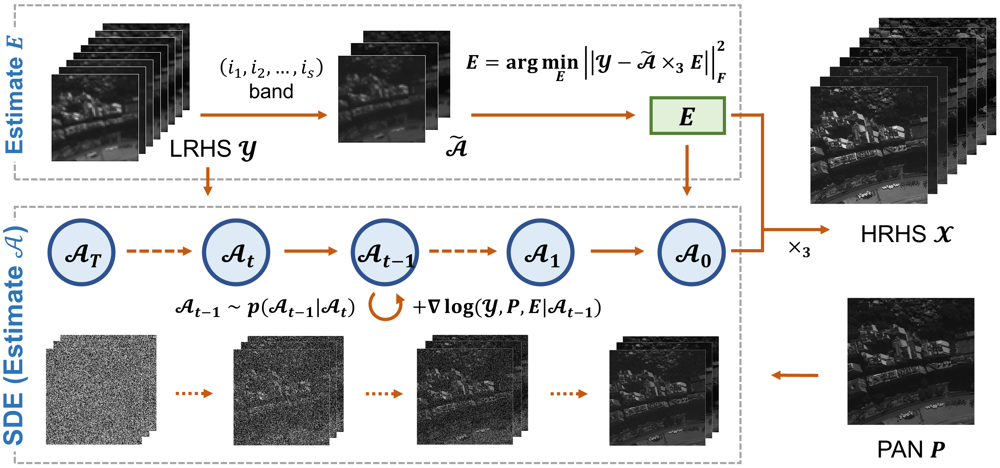

# Unsupervised Hyperspectral Pansharpening via Low-rank Diffusion Model (Information Fusion 2024)

    Xiangyu Rui, <a href="https://github.com/xiangyongcao">Xiangyong Cao</a>, <a href="https://github.com/LiPang">Li Pang</a>, <a href="https://github.com/Zeyu-Zhu">Zeyu Zhu</a>, <a href="https://github.com/zsyOAOA">Zongsheng Yue</a>, <a href="https://gr.xjtu.edu.cn/web/dymeng">Deyu Meng</a>

[[Main formal](https://www.sciencedirect.com/science/article/abs/pii/S1566253524001039)] [[Draft arxiv](https://arxiv.org/pdf/2305.10925.pdf)] 

Figure 1: The flowchart of the proposed method (PLRDiff). First, we estimate the coefficient matrix $E$ from the LRHS image. Second, the LRHS image, PAN image and the
coefficient matrix $E$ served as conditions are sent into a discretization of an SDE, where
we reconstruct the base tensor $\mathcal{A}$ by gradually sampling through a series of parameterized
distributions. Finally, the predicted $\mathcal{A}$ and $E$ are multiplied to form the desired HRHS
image.

## 1. Load pretrained Model 
Pretrained diffusion model can be downloaded from

[https://github.com/wgcban/ddpm-cd#arrow_forwardpre-trained-models--trainvaltest-logs](https://github.com/wgcban/ddpm-cd#arrow_forwardpre-trained-models--trainvaltest-logs)

*Retraining or finetuning this model is not mandatory. 

## 2. Dataset
### Reproduce the results
All datasets used in this work can be found in [Google Driver](https://drive.google.com/drive/folders/161ExMLMeGTyckdyAGdGjN0hKe3ONemkD?usp=drive_link) or [BaiduCloud](https://pan.baidu.com/s/1LO43relnFtt9l-Tz0BhTpA?pwd=op0f). 

These datasets can be directly used to reproduce the results presented in the manuscript.

### 2.1. Origianl dataset links
Here are the links to the original datasets. You can download them, crop the data and generate your own datasets if interested.

Chikusei: [https://naotoyokoya.com/Download.html](https://naotoyokoya.com/Download.html)

Houston: [https://hyperspectral.ee.uh.edu/?page id=459](https://hyperspectral.ee.uh.edu/?page_id=459)

Pavia: [https://github.com/liangjiandeng/HyperPanCollection](https://github.com/liangjiandeng/HyperPanCollection)

### 2.2. How do we generate the datasets
We generate our Chikusei and Houston datasets by 'data/generate_data.m'. Pavia can be directly downloaded from the above link for use. 

## 3. Testing
### 3.1. Run the code
run ``python3 demo_syn.py -res opt``

Before you running the script, please first download the pre-trained diffusion model, put it to your file and change the --resume in demo_syn.py.

### 3.2. Options
there are several options you can set:

-gpu: int

-dn: dataname,str. e.g. 'Chikusei'. The dataset should contain "HRMS", "LRMS" and "PAN". 

**-krtype: int. Set 0 for the first time in order to estimate kernel and srf. Set 1 if you have already save them in './estKR'.**

-res: str. Set 'opt' for estimating the residual and 'no' for R=0.

Other options include eta1, eta2, scale, ks, step, accstep. Please refer to demo_syn.py. 

## 4. Connections
<a href="mailto:xyrui.aca@gmail.com">xyrui.aca@gmail.com</a> 

